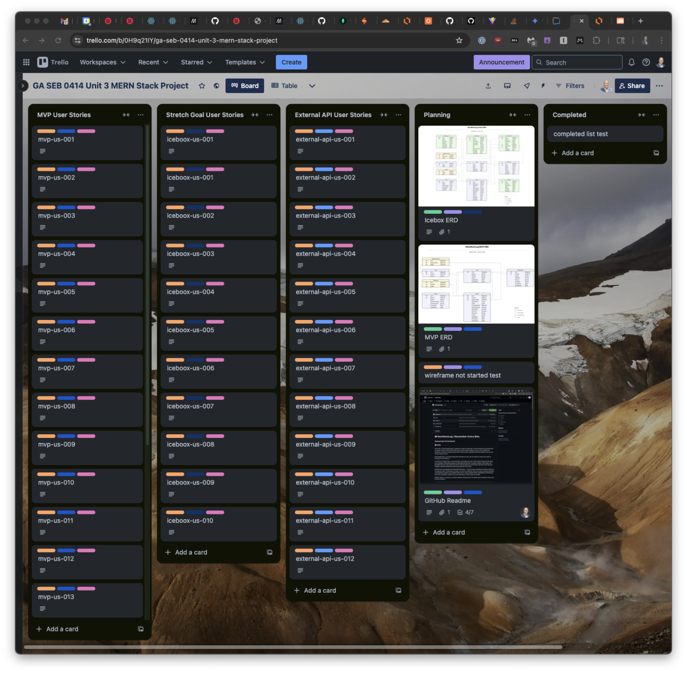
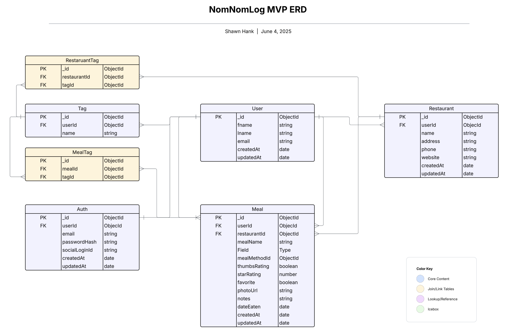
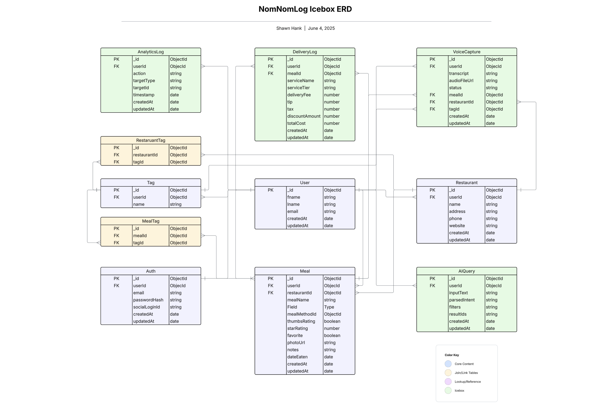

<table>
  <tr>
    <td>
      
    </td>
    <td valign="middle" style="padding-left: 1em;">
      

        <h1 style="margin: 0;">NomNomLog</h1>
        <h3 style="margin: 0;">Remember Every Bite</h3>
      

    </td>
  </tr>
</table>

---
--- 

## 📜 Intro
 

  Picture this: You had a great meal at a restaurant a couple of months ago. You were having such a good time that you forgot to make a note about the meal.  Now you want a repeat experience, but you can't remember the restaurant. You look for a receipt and can't find it. You look at your calendar and find the restaurant, but not what you ate. What do you do?

  Enter NomNomLog - your private dining diary that helps you track, rate, and reflect on meals you've eaten at restaurants or had delivered.

  It's perfect for frequent diners, business travelers, and foodies who want to make smarter decisions when dining out or ordering in.  While delivery apps and review sites like Uber Eats, DoorDash, GrubHub, Yelp, Google, and OpenTable track your order history, they lack the features that let you add personal notes about what was good enought to reorder and what you'll want to stay away from in the future.

  NomNomLog is your personal, and fully private dining diary — a smarter way to remember the meals you liked and the meals you didn't. And because it's private, you can be as candid and "real" as you want to be about all aspects of the experience.  Replace your scattered notes, post-its, emails, calendar entries, spreadsheets, and remove all that friction searchable, organized, fast and private history of all the meals you've eaten. 

  Whether dining in, carrying out, or having it delivered, NomNomLog is The smarter way to remember what you ate, and why you liked it.

---
---

**[Deployed App Link Placeholder](https://heroku.com)**

**[Screenshot Placeholder](https://github.com)**

**[Back End Repo Link Placeholder](https://github.com)**

---
---

##  🛠️ Technologeis Used

  | Layer | Technology | Purpose |
  |-------|------------|---------|
  | Frontend | [HTML](https://developer.mozilla.org/en-US/docs/Web/HTML) + [JavaScript](https://developer.mozilla.org/en-US/docs/Web/JavaScript) + [React](https://react.dev/) + [Vite](https://vite.dev/) | Core UI rendering |
  | Styling | [CSS Grid](https://developer.mozilla.org/en-US/docs/Learn_web_development/Core/CSS_layout/Grids) + [Flexbox](https://developer.mozilla.org/en-US/docs/Learn_web_development/Core/CSS_layout/Flexbox) + [Tailwind](https://tailwindcss.com/) | Responsive layout|
  | Backend | [Express](https://expressjs.com/) + [Node.js](https://nodejs.org/en) | REST API server |
  | Database | [MongoDB](https://www.mongodb.com/) + [Mongoose](https://mongoosejs.com/) | Data persistence and modeling |
  | Auth | [JWT](https://jwt.io/) + [bcrypt](https://www.npmjs.com/package/bcrypt) | Secure user sessions |
  | Deployment | [Heroku](https://www.heroku.com/) + [SSD Nodes](https://www.ssdnodes.com/) | App Hosting |

---
---
  
## Planning

---

### Trello Board

  **[View Public Trello Board in Browser](https://trello.com/b/0H9q21IY)**

  **Screenshot of Trello Board:**

  

---

### Documents

   [Core Features List](docs/core_features.md)

   [Data Model](docs/data_model.md)

   [CRUD Map](docs/crud_map.md)

   [User Stories](docs/user_stories.md)

   [Future Enhancements](docs/future_enhancements.md)

### Entity Relationship Diagrams

   

   

---
---

##  🔌 Attributions

  ### 📍 Mapping & Location

  **[Leaflet.js](https://leafletjs.com/) + [OpenStreetMap](https://www.openstreetmap.org/)**: Embed lightweight maps and markers for saved restaurants. Fully open-source solution using browser/device geolocation for on device mapping, one-click/tap directions, restaurant locations and more.

  **Apple Maps** and **Google Maps**

    - No public APIs — handled via deep link URL schemes.

  ### 🍽 Restaurant Info APIs

  **[Yelp Fusion API](https://docs.developer.yelp.com/docs/getting-started)** for search , autofill name/address/phone, fetch categories, ratings, photos, and links (5,000 free requests/day)
  
  **[Nominatim API (OpenStreetMap)](https://nominatim.org/)**: Convert addresses to latitude/longitude for mapping and distance calculations. Free, open-source, cache-friendly.

  ### 🚚 Food Delivery (Deep Linking Only)

  **Uber Eats, DoorDash, GrubHub**:
  
    - No public APIs — handled via deep link URL schemes.

  ### 📧 Communications
      
  **[Convert Kit](https://kit.com/)** for email for welcome, reset, digests, feature alerts, newsletters

  ### Diagramming and Wireframing

  **[Lucidchart.com Diagramming SaaS software](https://lucidchart.com) for Entity Relationship Diagrams**

  **[Wireframe.cc Diagramming SaaS software](https://wireframe.cc) for Wireframes**

  ### Project Management

  **[Trello Project Management SaaS software](https://trello.com) for Kanban Boards**

---
---

