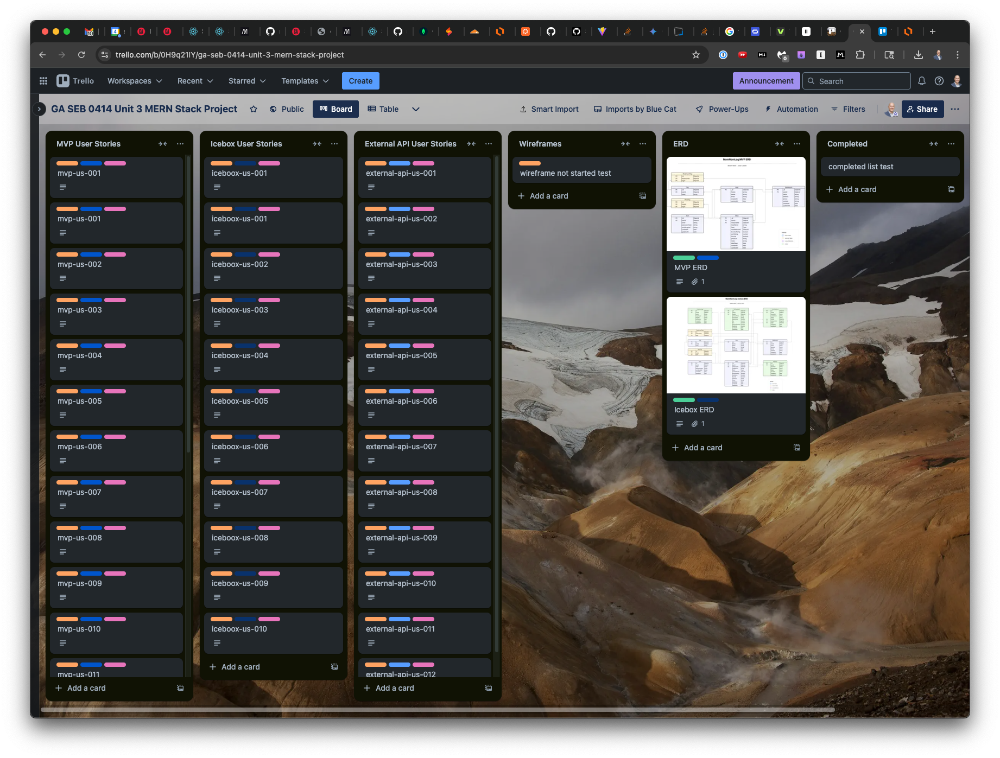

# 🍽️ NomNomLog | Remember Every Bite.

### Deployed App Link Placeholder

## 📜 Intro

  Picture this: You had a great meal at a restaurant a couple of months ago. You were having such a good time that you forgot to make a note about the meal.  Now you want a repeat experience, but you can't remember the restaurant. You look for a receipt and can't find it. You look at your calendar and find the restaurant, but not what you ate. What do you do?

  Enter NomNomLog - your private dining diary that helps you track, rate, and reflect on meals you've eaten at restaurants or had delivered.

  It's perfect for frequent diners, business travelers, and foodies who want to make smarter decisions when dining out or ordering in.  While delivery apps and review sites like Uber Eats, DoorDash, GrubHub, Yelp, Google, and OpenTable track your order history, they lack the features that let you add personal notes about what was good enought to reorder and what you'll want to stay away from in the future.

  NomNomLog is your personal, and fully private dining diary — a smarter way to remember the meals you liked and the meals you didn't. And because it's private, you can be as candid and "real" as you want to be about all aspects of the experience.  Replace your scattered notes, post-its, emails, calendar entries, spreadsheets, and remove all that friction searchable, organized, fast and private history of all the meals you've eaten. 

  Whether dining in, carrying out, or having it delivered, NomNomLog is The smarter way to remember what you ate, and why you liked it.

---
---

### Screenshot Placeholder

---
---

##  🧱 Core Features (MVP)

  * **Cross-Platform Use**
  
    * Mobile-ready responsive design (browser, phone, tablet)
    * Designed to load fast and work on the go

  * **User Authentication**

    * Users can sign up, log in, and securely manage their own data.
    * JWT-based authentication protects all user actions and data.
    * Email or social login (Google, Apple)
    * Private, secure meal log per user

  * **Meal Logging**

    * Log the meal name, description, restaurant, photo, rating, tags (e.g. "too spicy," "chef's special"), price, and personal comments.
    * Each meal is associated with a specific user and only visible/editable by them.
    * Meal name
    * Restaurant name (minimum required)
    * Thumbs up/down
    * Order again? (boolean)
    * Order again (yes / no)
    * Private Taste Records - fully private notes/comments with no social features
    * Optional photo upload
    * Date of meal (default: today)
    * Tags 
    * Favorite - Heart icon to mark best-of-the-best meals

  * **Log Restaurant Details**

    * Name
    * Address
    * Phone Number - Click/Tap to Call (from meal detail or restaurant detail page)
    * Website URL
    * Menu links
    * "Last ordered from here" tracker via "date of meal"
    
  * **Full CRUD**

    * Users can Create, Read, Update, and Delete their meals, restaurants, notes,
      tags, comments and unfavorite items
    
    * **Search & Filter by**
    
      * Restaurant
      * Meal
      * Thumbs up/down status
      * Favorite status
      * Date
      * Tags (e.g. spicy, comfort food, date night)

---
---

##  🛠️ Tech Stack

  | Layer | Technology | Purpose |
  |-------|------------|---------|
  | Frontend | HTML, JS, React (Vite) | Core UI rendering |
  | Styling | CSS Grid / Flexbox / Bootstrap / Tailwind | Responsive layout|
  | Backend | Express + Node.js | REST API server |
  | Database | MongoDB + Mongoose | Data persistence and modeling |
  | Auth | JWT & bcrypt | Secure user sessions |
  | Deployment | Heroku / Render / Railway / Other (e.g. local hosting, VPS, AWS, GCP, Azure, etc.)) | App Hosting |

---
---

### Trello Board

#### [View Public Trello Board in Browser](https://trello.com/b/0H9q21IY)

#### Screenshot of Trello Board
 
  

---
---

## 📖 User Stories

✅ MVP User Stories (Trello List: “MVP User Stories”)

    1.  As a user, I want to register and log in, so that I can access my private meal log.
    2.  As a user, I want to add a restaurant I ate at or ordered from.
    3.  As a user, I want to add a meal I ate, so that I can remember what I ordered.
    4.  As a user, I want to attach the meal to a restaurant, so that I know where I ate the meal.
    5.  As a user, I want to view a list of my meals, so that I can see everything I’ve eaten.
    6.  As a user, I want the option to use a thumbs up/down to quickly mark a meal as "order again" (thumbs up) or "don't order again" (thumbs down). 
    7.  As a user, I want the option to mark/unmark a meal as a favorite, so that I can find my best dishes easily.
    8.  As a user, I want to upload a photo of my meal, directly using the camera, from the camera roll, from an album, or from a file manager so that I have a visual reference.
    9.  As a user, I want to filter my meals by restaurant, thumbs up or down status, favorite status or tag, so that I can find specific ones.
    10. As a user, I want to add tags and attach them to meals and restaurants, so that I can organize views/lists by these tags.
    11. As a user, I want to view all my tags, so that I can view, edit and clean them up.
    12. As a user, I want to edit/remove/delete a single or multiple tags for meals so that I can fix mistakes or clean up my meal log.
    13. As a user, I want to edit/remove/delete a single or multiple tags for restaurants so that I can fix mistakes or clean up my meal log.
    14. As a user, I want to edit/remove/delete a single or multiple meals so that I can fix mistakes or clean up my meal log.
    15. As a user, I want to edit/remove/delete a single or multiple restaurants so that I can fix mistakes or clean up my meal log.
    16. As a user, I want to see all meals I’ve logged at a restaurant, so that I remember what I’ve tried.
    17. As a user, I want to add a note with comments about a meal.
    18. As a user, I want to edit the note/comment about a meal.
    19. As a user, I want to remove/delete the note/comment about a meal

---
---

🧊 Icebox / Stretch Goal User Stories (Trello List: “Stretch Goal User Stories”)

    1.  As a user, I want to log the delivery details (fees, tips, service, discounts), so that I can track my food spending.
    2.  As a user, I want to compare delivery services over time, so that I can see which one saves me more.
    3.  As a user, I want to see monthly or yearly food spending totals, so that I can reflect on habits or budget.
    4.  As a user, I want to search restaurants via API (e.g. Yelp), so that I can import details instead of typing them manually.
    5.  As a user, I want the app to remind me if I’ve eaten a meal before, so that I don’t accidentally repeat bad ones.
    6.  As a user, I want to export my meal log as a PDF or CSV, so that I can save or share it.
    7.  As a user, I want to filter my meals by “Would order again” status, so that I can build a go-to list.
    8.  As a user, I want to see my most-used tags, so that I can understand my food trends.
    9.  As a user, I want to rate a meal with using a 1 to 5 star rating so that I remember how much I liked it.
    10. As a user, I want to sort in ascending or descending order by: date, restaurant name or tag.

---
---

🛰 External Services & Smart Features

    1.  As a user, I want restaurant fields to auto-fill using Google or Yelp or other API, so that I don’t have to type addresses or phone numbers.
    2.  As a user, I want to see Yelp data like categories or ratings when I add a restaurant, so that I can get more context.
    3.  As a user, I want to tap an address for directions to a saved restaurant, so that I can navigate there quickly. (using Leafletjs.com)
    4.  As a user, I want the app to detect my location, so that I can log or find nearby restaurants and meals faster.
    5.  As a user, I want to open a delivery app link directly from a meal or restaurant, so that I can reorder faster.
    6.  As a user, I want to ask natural language questions like “What’s my best rated sushi?” so that I can discover great meals I’ve logged.
    7.  As a user, I want to filter meals using plain language like “spicy noodles I liked”, so that I don’t need advanced filters.
    8.  As a user, I want to log a meal using my voice, so that I don’t have to type on mobile.
    9.  As a user, I want the app to detect when I log the same dish repeatedly, so that I can reuse old entries.
    10. As a user, I want the app to suggest “nearby favorites” based on GPS, so that I can eat something I like.
    11. As a user, I want onboarding and tooltips to guide me, so that I understand how to use each feature.
    12. As a user, I want the app to occasionally nudge me with prompts like “Tried anything good lately?”, so that I build the habit of logging meals.

---
---

### Entity Relationship Diagrams

---
---

### Attributions Placeholder

##  🔌 External Services & Integrations

  ### 📍 Mapping & Location

    - *Leaflet.js + OpenStreetMap*: Embed lightweight maps and markers for saved restaurants. Fully open-source solution using browser/device geolocation for on device mapping, one-click/tap directions, restaurant locations and more.

    - Deep Linking for Apple and Google Maps

  ### 🍽 Restaurant Info APIs

    *Yelp Fusion API:* Search businesses, autofill name/address/phone, fetch categories, ratings, photos, and Yelp links (5,000 free requests/day).
  
    *Nominatim API (OpenStreetMap):* Convert addresses to latitude/longitude for mapping and distance calculations. Free, open-source, cache-friendly.

  ### 🚚 Food Delivery (Deep Linking Only)

    *Uber Eats, DoorDash, GrubHub:*
  
      - Smart links to restaurant or dish pages.
      - No public APIs — handled via deep link URL schemes when available.

  ### 📧 Communication
      
      - *SendGrid / Mailgun / Convert Kit*: Email for welcome, reset, digests, feature alerts

      

---
---

